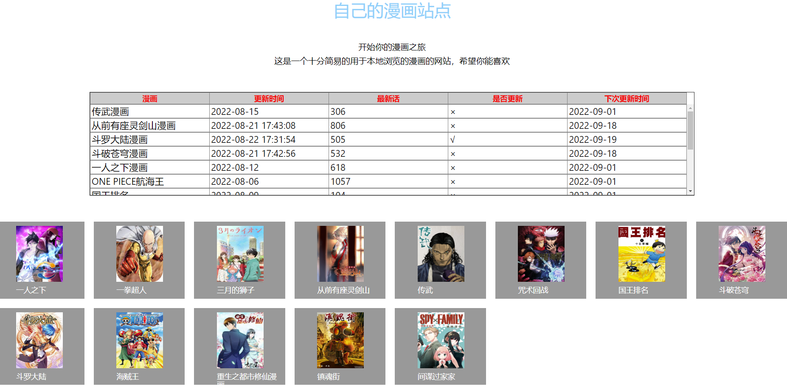
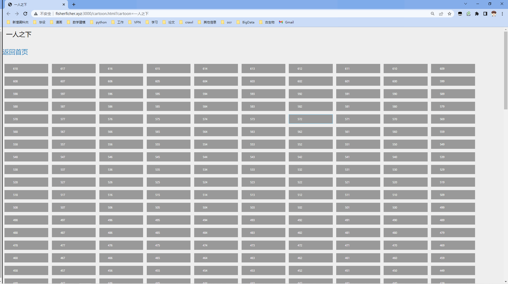
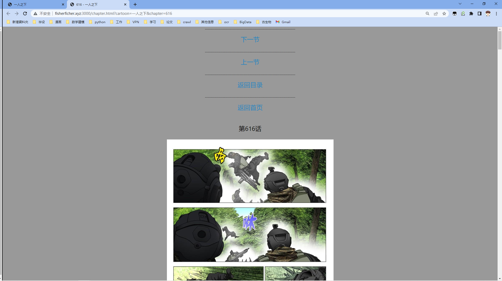

[English](README.md) | 简体中文

 

------------------------------------------------------------------------------------------

    
    
    
    # todo 添加scrapy 等信息

## 简介

CrawlManga 包含多个漫画爬虫，以及将下载的漫画上传到远端服务器

**近期更新**

- 添加针对maofly漫画网站的爬虫maoflyManga (https://www.maofly.com/)
- 添加针对xingqiu漫画网站的爬虫xingqiuManga (http://m.mhxqiu1.com/)
- 添加将本地文件上传到服务器的代码(https://github.com/ficherfisher/CrawlManga/blob/master/uploadServer/uploadServer.md)
- [More](https://github.com/PaddlePaddle/PaddleOCR/blob/release/2.2/doc/doc_ch/update.md)

## 特性

- 全自动更新漫画网站
- 支持断点续爬网站
    - 包括断点重传文件
- 可运行于Linux、Windows等多种系统

## 效果展示

    
    

上图是通用PP-OCR server模型效果展示，更多效果图请见[效果展示页面](http://fisherficher.xyz:3000/)。

## 快速体验
- fisher漫画网站

## 漫画列表（更新中）

|漫画|更新时间|最新话|是否更新|下次更新时间|网址|
|------------|---------------|----------------|----|----------|----------|
|传武漫画|2022-08-15|306 | ×|2022-09-01|[最新话306](http://fisherficher.xyz:3000/cartoon.html?cartoon=%E4%BC%A0%E6%AD%A6)|
|从前有座灵剑山漫画|2022-08-21 17:43:08|806 | ×|2022-09-18|[最新话806](http://fisherficher.xyz:3000/cartoon.html?cartoon=%E4%BB%8E%E5%89%8D%E6%9C%89%E5%BA%A7%E7%81%B5%E5%89%91%E5%B1%B1)|
|斗罗大陆漫画|2022-08-22 17:31:54|505 | ×|2022-09-19|[最新话505](http://fisherficher.xyz:3000/cartoon.html?cartoon=%E6%96%97%E7%BD%97%E5%A4%A7%E9%99%86)|
|斗破苍穹漫画|2022-08-21 17:42:56|532 | ×|2022-09-01|[最新话532](http://fisherficher.xyz:3000/cartoon.html?cartoon=%E6%96%97%E7%A0%B4%E8%8B%8D%E7%A9%B9)|
|一人之下漫画|2022-08-12|618| ×|2022-09-01|[最新话618](http://fisherficher.xyz:3000/cartoon.html?cartoon=%E4%B8%80%E4%BA%BA%E4%B9%8B%E4%B8%8B)|
|ONE PIECE航海王|2022-08-06|1057 | ×|2022-09-01|[最新话1057](http://fisherficher.xyz:3000/cartoon.html?cartoon=%E4%BC%A0%E6%AD%A6)|
|国王排名|2022-08-09|104 | ×|2022-09-01|[最新话104](http://fisherficher.xyz:3000/cartoon.html?cartoon=%E4%BC%A0%E6%AD%A6)|
|间谍过家家|2022-08-09|77 | ×|2022-09-01|[最新话77](http://fisherficher.xyz:3000/cartoon.html?cartoon=%E4%BC%A0%E6%AD%A6)|
|一拳超人|2022-08-21|234 | ×|2022-09-18|[最新话234](http://fisherficher.xyz:3000/cartoon.html?cartoon=%E4%BC%A0%E6%AD%A6)|
|咒术回战|2022-08-21|195 | ×|2022-09-01|[最新话195](http://fisherficher.xyz:3000/cartoon.html?cartoon=%E4%BC%A0%E6%AD%A6)|
|重生之都市修仙漫画|2022-08-21|815 | ×|2022-09-01|[最新话815 ](http://fisherficher.xyz:3000/cartoon.html?cartoon=%E4%BC%A0%E6%AD%A6)|
|三月的狮子|2021-11-15|185 | ×|2022-09-01|[最新话185](http://fisherficher.xyz:3000/cartoon.html?cartoon=%E4%BC%A0%E6%AD%A6)|
|镇魂街|2022-07-15|375 | ×|2022-09-01|[最新话375](http://fisherficher.xyz:3000/cartoon.html?cartoon=%E4%BC%A0%E6%AD%A6)|

更多漫画可以联系作者(yupengxiong87@gmail.com)

